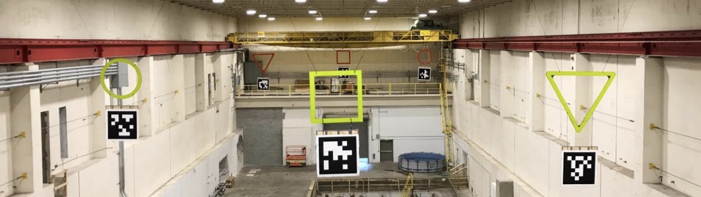
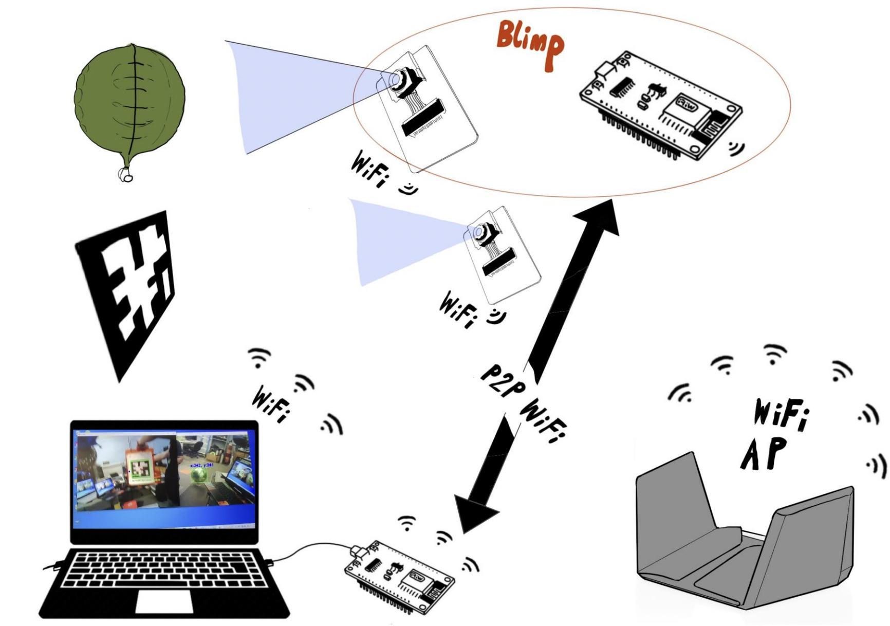
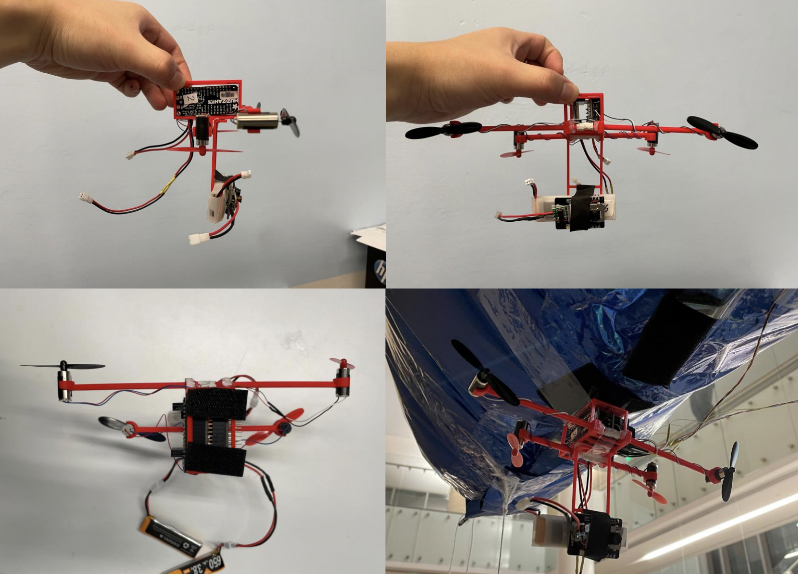
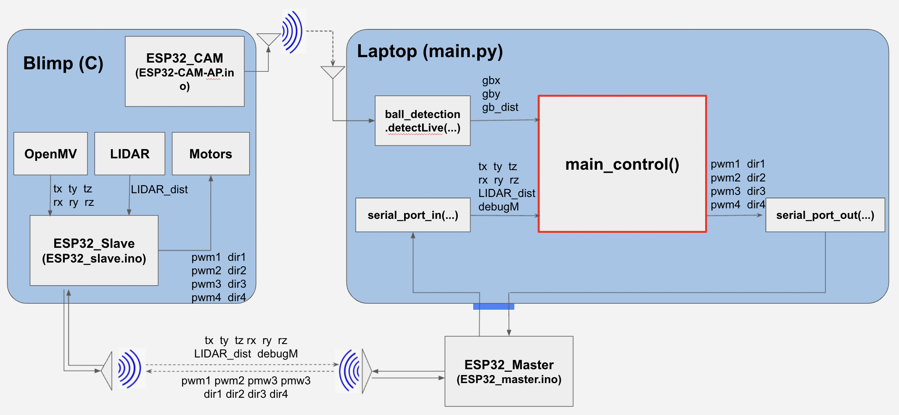

# Autonomous Blimp

Check Progress and Demo Video Here

https://uclalemur.com/blog/tag:foray

## Introduction

**Tasks**: Let a fleet of blimps play *quiddich* automatically

**Compeition Field**



**Overall System Cartoon**



**Our Hardware setup (Gondola)**



## Components Needed

* One ESP32 Feather Board, Stacking Header (https://www.adafruit.com/product/3405)

* One Adafruit Neopixel LED Panel, Plain Header (https://www.adafruit.com/product/2945)
* One Adafruit Radio FeatherWing 433MHz, Stacking Header (https://www.adafruit.com/product/3230)
* Wires for I2C and motor connection
* Electronic Components Mount* (in General 3D Print Design)
* 1 to 3 Lipo Batteries 3.7V-3.8V (https://www.amazon.com/Crazepony-Battery-PowerWhoop-Connector-Inductrix/dp/B07L9SHHFX)
* ESP CAMPS
* Velcro Tape
* Two Blimp (https://www.amazon.com/Swimmers-Remote-Control-Flying-Clownfish/dp/B005FYCBR6/ref=sr_1_5?crid=1QSXYA4FQYTC1&dchild=1&keywords=air+swimmers+remote+control+flying+fish&qid=1629779292&sprefix=air+swimmers%2Caps%2C229&sr=8-5)
* Two 2.2kOhms resistors
* Helium
* Four DC motors
* Four Propellers

## Software Requirements

### Step 1: 

Download Anaconda or Pycharm

### Step 2: 

- If using Anaconda, then create a virtual environment first:

```shell
# crreate virtual environment
conda create -n FORAYenv python=3.7
# activate virtual environment
conda activate FORAYenv
# install environment installation tool pip (if it doesn't have one)
conda install pip
```

- If using Pycharm, at the very beginning, create a virtual environment


### Step 3:

Install dependency

- If using Anaconda, install it from the terminal. And always remember to activate the conda environment fist: `conda activate FORAYenv`

```shell
# install pyserial
pip install pyserial
# install pygame 
pip install pygame
# install cv2
pip install opencv-python
# install torch 
conda install pytorch torchvision torchaudio cudatoolkit=10.2 -c pytorch
# install pupil-apriltags
pip install pupil-apriltags
# install detecto
pip install detecto==1.2.1
```


## Main_code

There are two files about main code: 

- constants.py: it stores global variables that can be changed easily

- main_joystick: it has keyboard interruption and it contains all the functions that we need.

### Flowchart


### System I/O (old)



